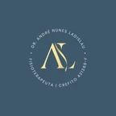
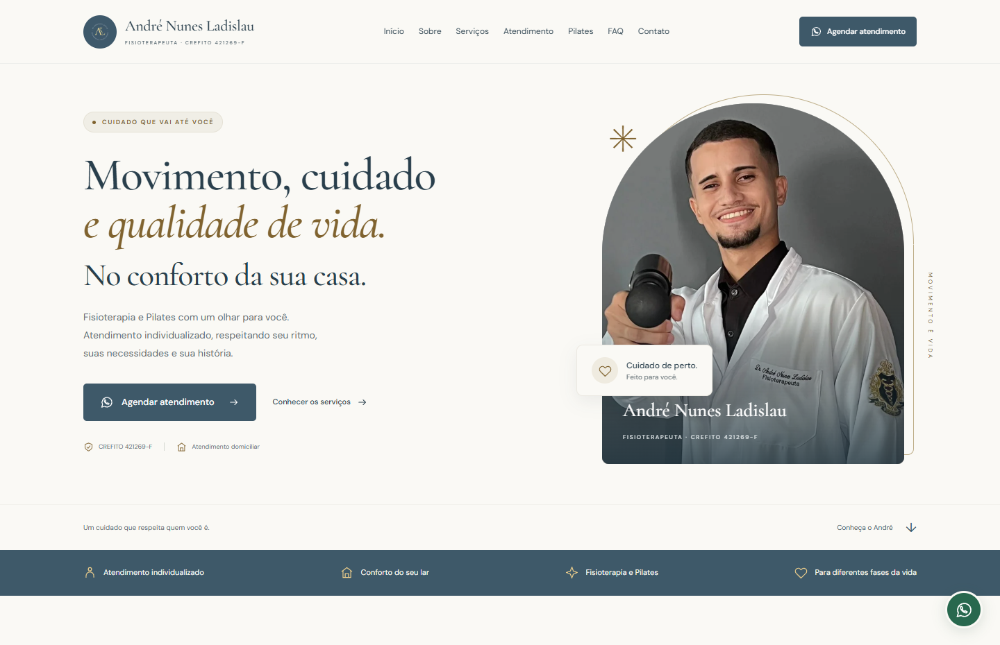



  

<h1 align="center">Cuidado que vai até você</h1>

  Fisioterapia e Pilates · André Nunes Ladislau 
  Um projeto feito para ajudar um amigo.

  <a href="https://drandrenunesfisio.com.br/"><strong>Visitar o site ↗</strong></a>

## 💙 Por trás do projeto

Meu amigo André é fisioterapeuta e estava precisando de um site para apresentar seu trabalho e facilitar o contato com novos pacientes. Criei este projeto para ajudá-lo a ter esse espaço na internet, com a identidade dele e uma experiência simples para quem procura atendimento.

A ideia foi levar para a página o cuidado e a proximidade que fazem parte da proposta do atendimento domiciliar.

## ✨ Pensado para quem precisa de cuidado

- **Conhecer o André:** apresentação profissional, fotos reais e sua identidade visual.
- **Entender o atendimento:** informações sobre fisioterapia domiciliar, Pilates e cuidados em diferentes fases da vida.
- **Tirar dúvidas:** respostas às principais perguntas sobre os serviços e o agendamento.
- **Dar o primeiro passo:** contato direto pelo WhatsApp, sempre ao alcance.

## 🎨 A identidade do site

O azul e o dourado da marca se encontram com fundos claros, tipografia elegante e espaços que deixam a leitura mais leve. O layout se adapta ao celular e ao computador, com atenção à acessibilidade e ao carregamento das imagens.

## 🧩 Tecnologias

**Angular · TypeScript · HTML · CSS · GitHub Pages**

---

  Desenvolvido por <a href="https://github.com/Heitor-Bailke">Heitor Bailke</a> 
  Para ajudar um amigo a apresentar seu trabalho ao mundo.

